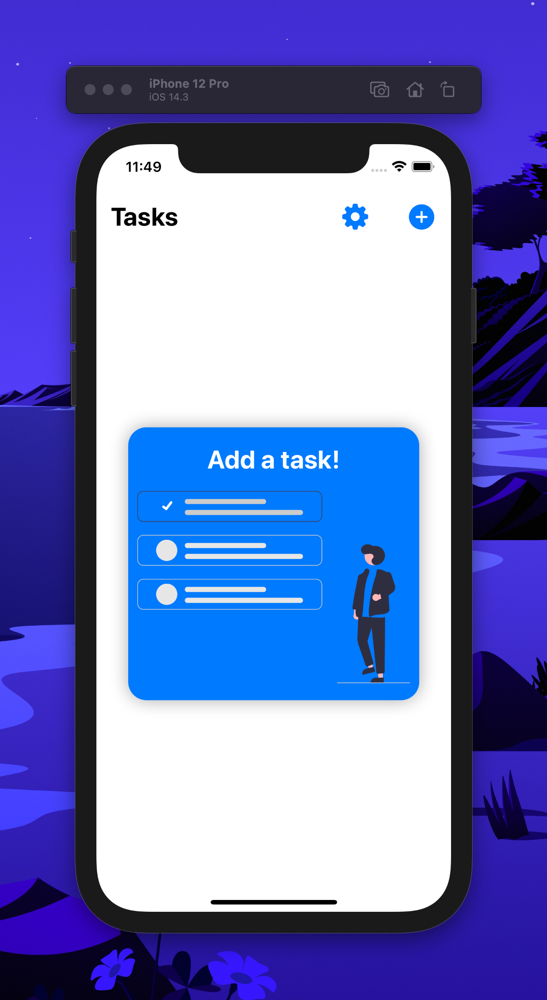
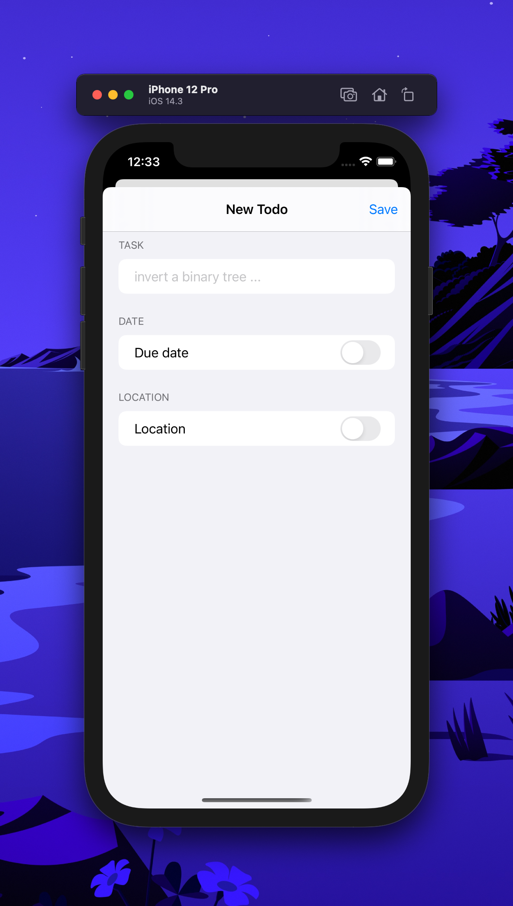
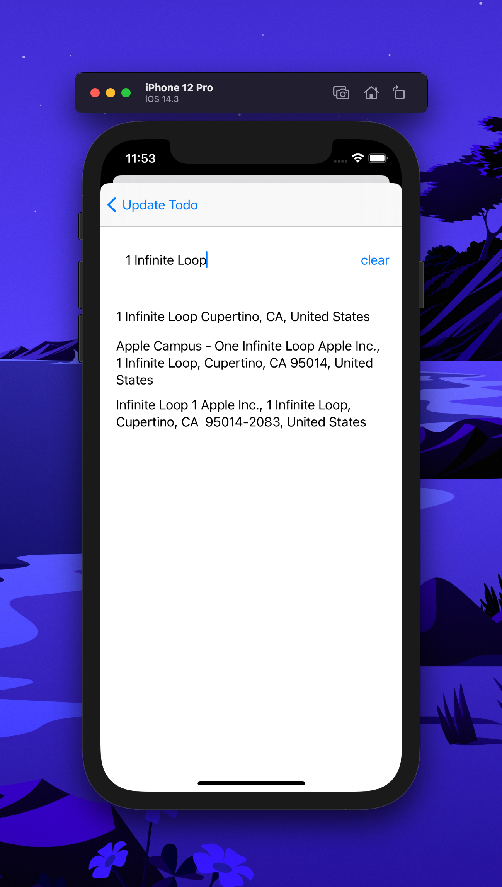
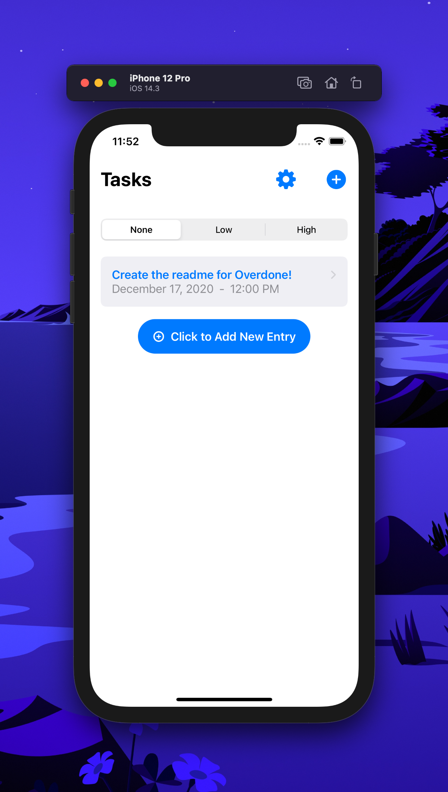
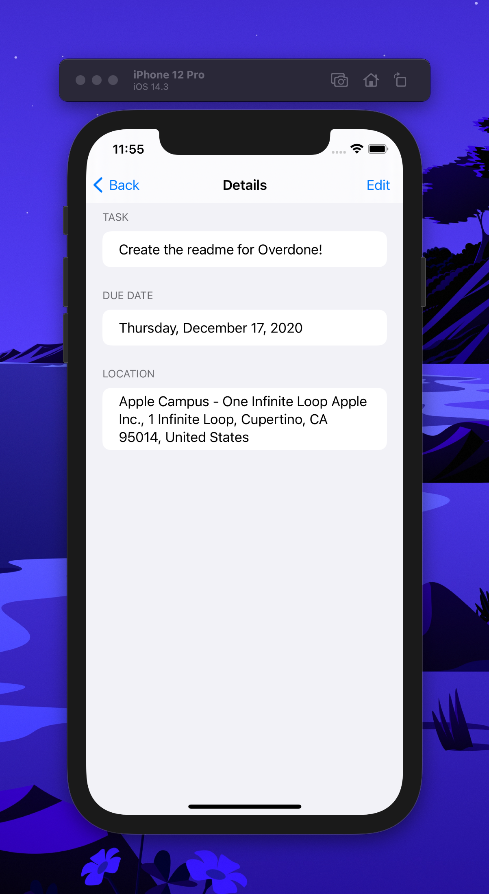
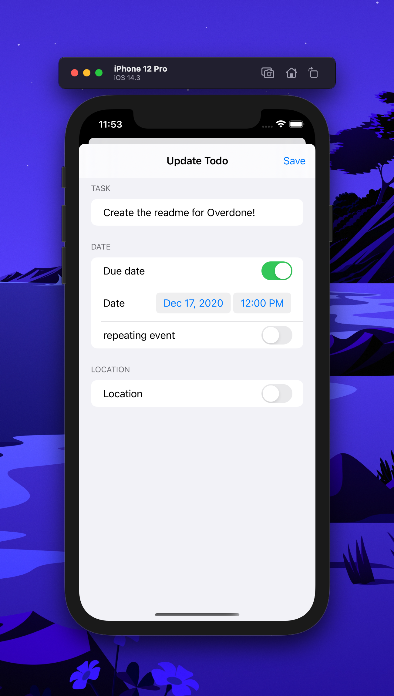

# Overdone

  
  
  
  
  

A simple iOS app designed to track a users everyday todo's!

# Usage

Simply open project and run on desired target!
(Check back soon for a TestFlight release!)

# Suggestions

If you have any suggestions on how this application can be improves feel free to at me [@aridokmecian](http://twitter.com/aridokmecian) !

# Gallery

  

  

  

  

  

  

